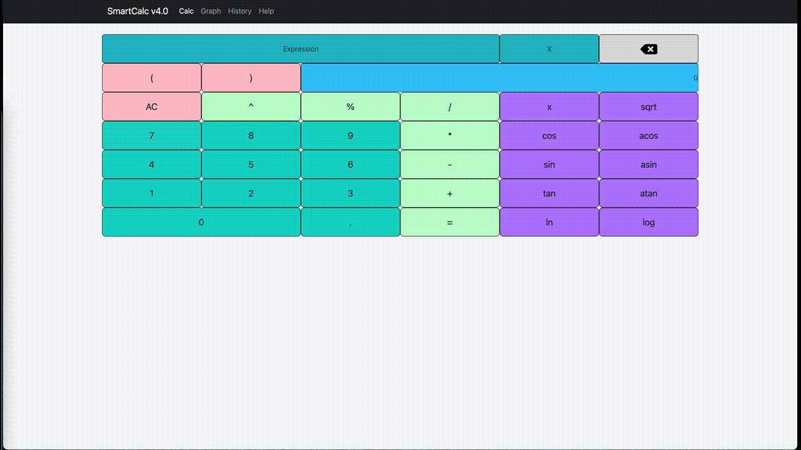
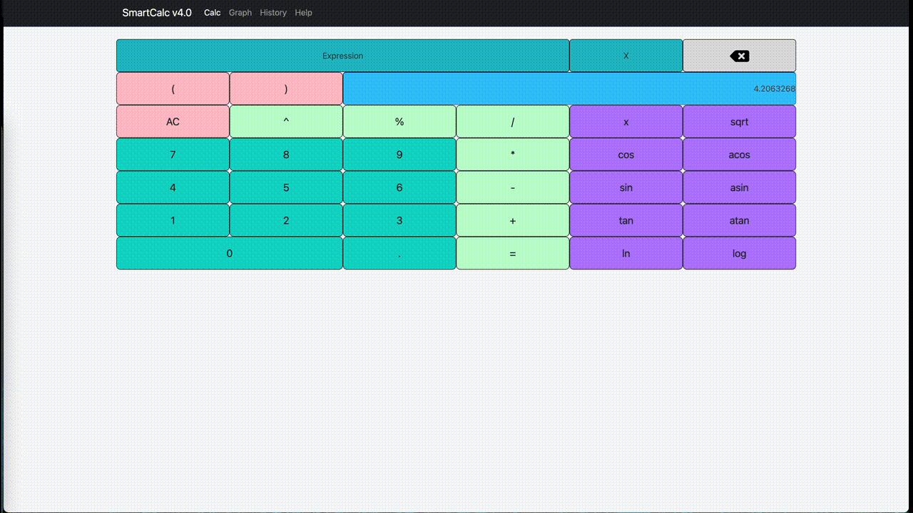
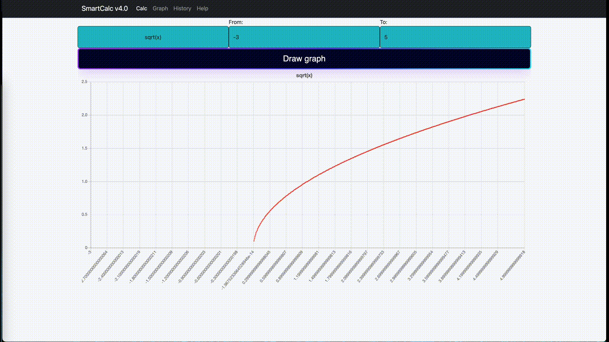
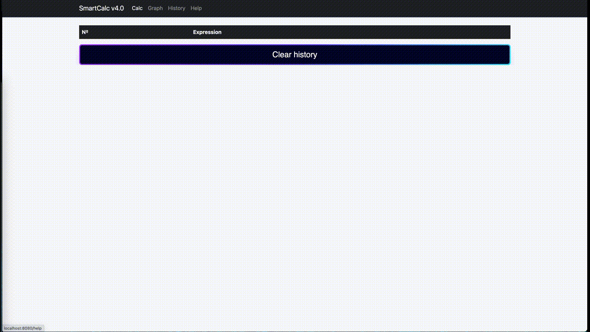

# SmartCalc_v4.0_Web_Java

Это help по программе SmartCalc от Sfeta, School21.
Эта программа умеет вычислять математические выражения, рисовать график функций, а также имеет историю введенных выражений.

Собирается через makefile+maven wrapper, переходим в корень репозитория вводим - make, после сборки откроется страничка в хроме, она открывается раньше запуска spring, поэтому ждем пару сек и перезагружаем страницу, можно пользоваться.
Делалось под macos, под linux надо пересобирать динамическую библиотеку как это принятно там.

Приложение открывается вкладной calc - это калькулятор выражений.
Чтобы ввести выражение - выберите поле expression и начните ввод.
Ввод может продолжаться до тех пор, пока не будет нажат оператор =, вводить можно до 256 символов.
При вводе выражения с х нужно заполнить поле для x, оно располагается слева от строки ввода выражения.
Есть кнопка удаления последнего символа из строки ввода, оно располагается справа от строки ввода выражения.

Во вкладке Graph есть поле для ввода выражения, регуляторы диапозона графика и ввод кнопка рисования графика. 
В формах ввода начального и конечного номеров можно
установить диапазон рендера от -1000000 до 1000000, но лучше не ставить такие большие значения - это может занять много времени, или программа может зависнуть, по умолчанию график рисуется от -10 до 10.

Во вкладке history - история выражений, запись делается в момент нажатия на кнопку =. История выражений хранится и между запусками программы, очищается на кнопку clean.

Во вкладке help -  документация, если это можно так назвать.

For englishman, auto-traslate:

This is the help for the SmartCalc program from Sfeta, School21.
This program is able to calculate mathematical expressions, draw a graph of functions, and also has a history of entered expressions.

It is built through makefile+maven wrapper, go to the root of the repository enter - make, after building will open a page in chrome, it opens before spring, so wait a couple of seconds and reload the page, you can use.
It was done under macos, under linux it is necessary to rebuild dynamic library as it is accepted there.

The application opens with an embedded calc - this is an expression calculator.
To enter an expression, select the expression field and start typing.
The input can continue until the = operator is pressed, up to 256 characters can be entered.
When entering an expression with x, you need to fill in the field for x, it is located to the left of the expression input line.
There is a button to delete the last character from the input line, it is located to the right of the input line of the expression.

In the Graph tab there is a field for entering an expression, the range controls of the graph and the input button for drawing a graph. 
In the input forms of the start and end numbers, you can
set the render range from -1000000 to 1000000, but it is better not to set such large values - it may take a long time, or the program may hang, by default the graph is drawn from -10 to 10.

In the history tab - the history of expressions, the record is made at the time of clicking on the = button. The history of expressions is also stored between program launches, cleared by pressing the clean button.

In the help - documentation tab, if you can call it that.
